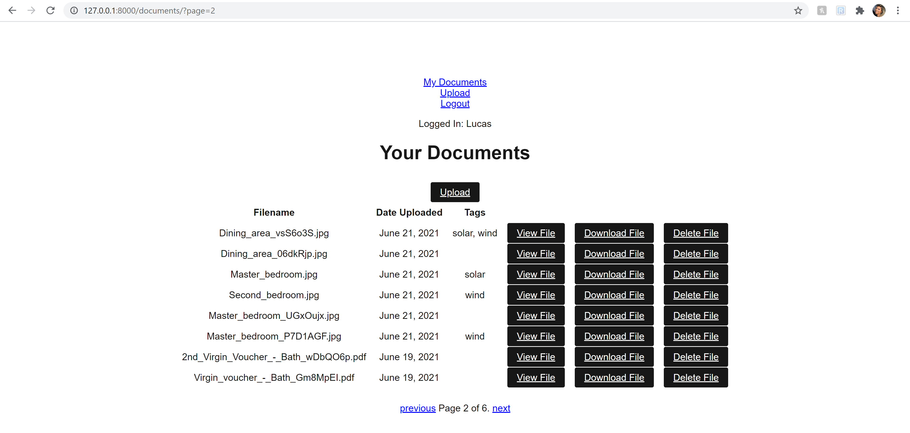

# Introduction

The aim of this project is to create a website to store important documents. Users can only view their own documents if they are correctly logged in. 
Once logged in, users can view, download, or delete their documents from the database. Multiple file uploads are possible.   

## Technologies

Python 3.9, Django==3.2.3, coverage==5.5, Black

## Getting Started

Please follow the instructions below to run this application. 

1 - download this repo as a zip file and unzip it to your working directory.  
2 - install Python 3.9 if you haven't already


## (Optional) Create and use a virtual environment:
## https://packaging.python.org/guides/installing-using-pip-and-virtual-environments/#creating-a-virtual-environment
```python -m venv env```

```source env/bin/activate```

## Install Django and my other dependencies:
## https://pip.pypa.io/en/stable/user_guide/#requirements-files
```pip install -r requirements.txt```

## Run my tests (all should pass):
```python manage.py test```

## Optional: run Coverage (using batch file) to receive a test coverage report in stdout
```cvrg.bat```

## Build the database:
```python manage.py migrate```

## Start the Django development server:
## https://docs.djangoproject.com/en/3.2/ref/django-admin/#django-admin-runserver
```python manage.py runserver```


After these commands, you should be able to see the homepage at http://localhost:8000/.

You will need to create a super user to access the Django admin site and to 
login (https://docs.djangoproject.com/en/3.2/ref/contrib/admin/): to do this, 
run `python manage.py createsuperuser` and follow the instructions.

## Project Status

Still being developed. 
###### To do:

- Add a way of checking for duplicate file uploads
- Improve tag functionality, so that users can create tags themselves and filter by them
- Add an update view, so that the tags for a document can be edited by the user
- Add integrated tests using Selenium
